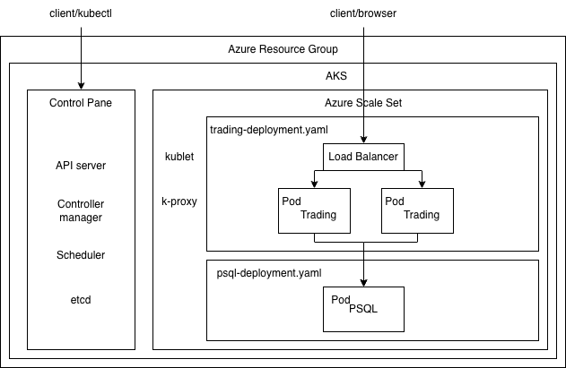
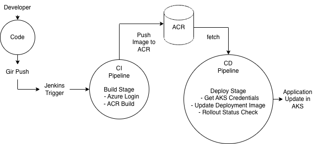

# Introduction
This project demonstrates a cloud-native trading application deployed on Azure Kubernetes Service (AKS) with a fully automated CI/CD pipeline using Jenkins.

The system is designed with:
- Azure Kubernetes Service (AKS)
- Azure Container Registry (ACR)
- Jenkins (running inside Kubernetes)
- Helm (for Kubernetes packaging)
- PostgreSQL database
- Separate Dev and Prod environments

Two AKS clusters are provisioned: Dev and Prod.
Both clusters:
- Pull container images from ACR
- Use Kubernetes Deployments & Services

The Jenkins pipeline:
1. Authenticates to Azure using a Service Principal
2. Builds Docker image using Azure ACR build 
3. Pushes image to Azure Container Registry 
4. Retrieves AKS credentials 
5. Updates Kubernetes deployment image 
6. Waits for rollout to complete

# Application Architecture
The application consists of:
- Azure Load Balancer (exposes service externally)
- Kubernetes Deployment (Spring Boot application)
- Horizontal scaling capability
- PostgreSQL database pod
- Azure Container Registry (ACR) for container images
- Jenkins for CI/CD automation
## AKS Deployment Diagram



# Jenkins CI/CD pipeline

## Pipeline Stages
### Init Stage
- Logs into Azure using Service Principal
- Validates Azure CLI
```bash
az login --service-principal
```
### Build & Push Stage
- Uses Azure Container Registry build
- Builds Spring Boot image
- Tags image using `${BUILD_NUMBER}`
- Pushes image directly to ACR
```bash
az acr build --image trading-app:${BUILD_NUMBER}
```
### Deploy Stage
- Fetches AKS credentials
- Updates Kubernetes deployment image
- Waits for rollout
```bash
kubectl set image deployment/trading trading=${ACR_NAME}/${IMAGE}
kubectl rollout status deployment/trading
```

## CI/CD Pipeline Diagram


# Improvements
- Add Horizontal Pod Autoscaler
- Add Monitoring & Logging, e.g., Azure Monitor
- Implement Helm Charts for deployment/trading