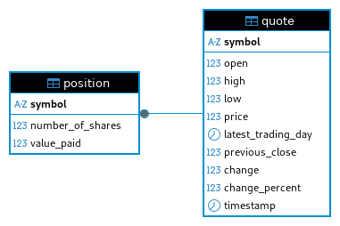

# Introduction
StockQuote is a simple command-line application that lets you fetch live stock quote data from the Finnhub API, store buy/sell positions in a local PostgreSQL database, and view your portfolio value. It follows a DAO + service architecture with JDBC/PSQL for data storage.
Logs are separated into flow (INFO/DEBUG) and error (WARN/ERROR) files (in a logs/ directory), using SLF4J. The project was built using Java 8 and Maven (packaged as a shaded fat JAR), and can be deployed via Docker Compose with ready-to-use containers on Docker Hub.
Unit and integration tests were written using JUnit 5 and Mockito. Network calls use OkHttp, and JSON parsing uses Jackson. A properties file is used to configure environment-specific values such as the API key and DB credentials.

# Quick Start
## Option 1 (recommended):
Download the `docker-compose.yml`
```bash
# From the directory containing docker-compose.yml:
docker compose up -d

# Run a command in the app container:
docker compose run --rm app <command>
```
This will:

- spin up the database and app containers,

- configure networking between them,

- initialize the database schema (on first run),

- and mount logs inside a logs/ directory for easy access.


## Option 2: Run the containers separately (manual network)
```bash
# Create a Docker network
docker network create stock-quote-net

# Start DB container in the background

docker run -d --name jrvs-pgjdbc \
--network stock-quote-net \
-p 5432:5432 \
-v pgdata:/var/lib/postgresql/data \
fraserraney/stockquote-db

# Run the application container (one-off)
 docker run --rm --network stock-quote-net \
 -v `pwd`/logs:/logs \
 fraserraney/stockquote <command>
```
Logs will be written into the logs/ directory in your project folder (flow.log, error.log).

## Option 3:
```bash
docker compose -f oci://fraserraney/stockquote-app:latest up -d
docker compose -f oci://fraserraney/stockquote-app:latest run --rm app <command>
```
Note the logs/ folder will be in a location you .cache/docker/ folder that's printed to the terminal when you run the command

# Implementaiton
## Database
The database schema is defined via an SQL script (sql/ddl.sql). For production or sharing, a custom Docker image (based on postgres:16-alpine) is built that copies the init script to /docker-entrypoint-initdb.d/. On first container startup (with an empty data dir), PostgreSQL runs the script so that the DB is pre-initialized.
### ER Diagram


## App
This project uses a DAO (Data Access Object) pattern to abstract database operations (CRUD) into separate *Dao classes (QuoteDao, PositionDao, etc.), decoupling raw SQL and JDBC from business logic. On top sits a service layer (QuoteService, PositionService) that contains core business logic (fetching quotes from API, processing buy/sell, handling validation, and combining data from API and DB). The controller layer handles user input and orchestrates calls to services and DAOs.
### Pseudocode
```
// Config loading: reads credentials, API key, DB URL/host from properties file
try
load config  
catch (FileNotFound or IO)  
log error, exit

// DB Connection   
try
open DB connection  
catch (SQLException)  
log error, exit

// DAO layer
new QuoteDao(connection)
new PositionDao(connection)

// Service layer
new QuoteService()  
new PositionService()

// Controller / CLI layer
new StockQuoteController().init(args)
```

## Design Patterns
The DAO pattern defines an abstraction layer over a data source. A DAO hides details of how data is stored and retrieved, exposing simple CRUD methods for one or more entities. The rest of the application doesn't need to know whether data resides in a relational database, a file, or something else; it just calls DAO methods. This decoupling improves maintainability, allows easier switching of underlying databases, and keeps persistence logic separate from business logic.
The Repository pattern sits at a higher level of abstraction. Rather than exposing raw data-access operations, a repository presents a domain-oriented collection abstraction. It behaves like an in-memory collection of domain objects: Instead of CRUD by table/row, a repository exposes methods in terms of domain behaviour: "get all positions," "find quotes by symbol," "save a position after a trade," etc. The rest of the application works in domain language, unaware of SQL or the underlying storage. Internally, a Repository might use one or more DAOs (or other mechanisms), but externally it hides the storage details and presents a clean domain-centric interface. This gives your business logic a cleaner, more expressive interface, working in domain terms rather than persistence terms.

# Test
- DAO layer tests, using a local test database to validate CRUD functionality.

- Utility class tests, HTTP helper using mockito to mock api response.

- Service layer tests, both unit (mocking HTTP using Mockito) and integration (real DB, real HTTP and mocked HTTP).

- All tests have been run and passed.

# Deployment
The project uses separate Docker containers for the database and application:

- The DB container is based on postgres:16-alpine, pre-configured with init SQL to create the schema and default DB.

- The App container is based on amazoncorretto:8-alpine that contains the shaded JAR and configuration files.

Using docker-compose.yml, both containers can be deployed together with a single command, ensuring proper startup order, networking, and volume mapping (for persistence and logs).

# Improvement
- Add a user-friendly UI (web-based or GUI) rather than just CLI.

- Expand available data-fetch with extra fields from the API, support more API calls, or support multiple data sources.

- Add support for partial sell orders and performance metrics/more sophisticated portfolio valuation.
