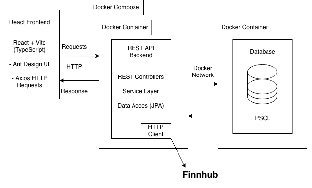
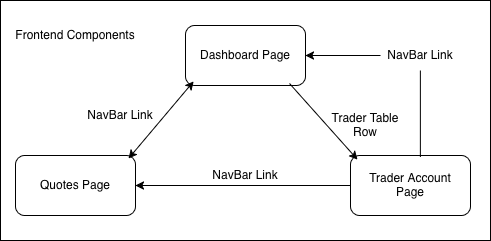

# Introduction
This project is a full-stack web application designed to manage and visualize trading-related data through a modern, responsive dashboard interface. The primary users of the application are internal users, such as administrators or developers, who need to create, view, update, and delete trader records through a clean and intuitive UI.

The frontend is built using React with TypeScript, providing a component-based architecture and type safety. Ant Design (antd) is used for UI components, such as tables and modal forms, to ensure a consistent user experience. Data is fetched from the backend using Axios, and React hooks (useEffect, useState) are used for state and lifecycle management.

The backend is implemented using Spring Boot, exposing a RESTful API for managing trader data from Finnhub. The backend is packaged with Docker Compose on Docker Hub, making it easy to run locally or deploy consistently across environments. Communication between the frontend and backend happens over HTTP with CORS configuration for local development.

Overall, uses a typical full-stack setup with React, Spring Boot, Docker, REST APIs, and with a focus on clean architecture and maintainability.

# Quick Start
## Prerequisites

- Docker 
- Node.js
- npm

## Backend (Docker)
Run the following in a local folder such as Downloads:
```bash
docker compose -f oci://fraserraney/trading-compose:latest up -d
```
The backend API will be available at: `http://localhost:8080`.

## Frontend
In the trader-ui folder containing the project's `package.json`, run:
```bash
npm install
npm run dev
```
The frontend will be available at: `http://localhost:5173`.

# Implemenation
The frontend is structured using a feature-based folder layout, separating pages and components. Tables include sorting.

CRUD operations (create, read, delete) are implemented using Ant Design forms and modals. Forms include validation. After create or delete operations, the UI automatically refreshes by refetching data from the backend to ensure consistency with the database.

The backend exposes REST endpoints for managing traders and also exposes a simple Swagger UI interface at `http://localhost:8080/swagger-ui.html`.

## Architecture

### Component Diagram


### Frontend Components


# Test
## Frontend
- Manual testing was done through the UI.
- Form validation was implemented using Ant Design rules.
- Network error handling was tested by stopping the backend container.

## Backend
- API endpoints were tested through the Swagger UI interface. 
- CRUD operations were verified against the database. 
- CORS configuration was tested for local frontend access.

### To test the app:
- Start the backend container.
- Run the frontend.
- Use the dashboard to add, view, and delete traders.

# Deployment
- The Source code is hosted on GitHub.
- The Backend is packaged and deployed as Docker images with Docker Compose, so the application can be deployed to any Docker-compatible environment.
- The Frontend can be built and hosted via any static hosting (e.g., GitHub Pages, Nginx, S3).

# Improvements
- Handle adding and removing quotes to the daily list.
- Add update/edit functionality for traders.
- Add pagination and filtering to tables.