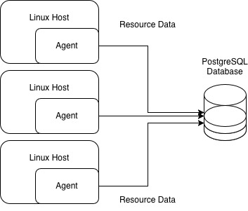

# Linux Cluster Monitoring Agent
This project implements a Linux cluster monitoring agent that collects and stores 
hardware and resource usage data. It helps system 
administrators track CPU, memory, and disk performance. The intention is that this can be 
scaled across multiple servers in a distributed 
environment. The system consists of two Bash scripts: one that records hardware 
information and another that periodically logs server usage metrics using crontab. 
Data is stored in a PostgreSQL database running inside a Docker container, allowing easy 
deployment from a shell script. Git is used for version control. The design can be 
scaled by enabling multiple nodes to 
report to a single database instance, providing real-time visibility into cluster 
health and performance through simple SQL queries.

## Setup
Follow the steps below to set up and run the Linux Cluster Monitoring Agent.
### 1.1 If necessary, create the Docker container for the PostgreSQL instance

```bash
./scripts/psql_docker.sh create [db_username] [db_password]
```


### 1.2 Start a PostgreSQL instance using Docker
```bash
./scripts/psql_docker.sh start
```

### 2. Create the database tables
```bash
psql -h localhost -U [db_username] -d host_agent -f sql/ddl.sql
```

### 3. Insert hardware specifications data
```bash
./scripts/host_info.sh localhost 5432 host_agent [db_username] [db_password]
```
### 4. To automate periodic data collection (every minute):
```bash
crontab -e
```
Then add the following line to the `crontab` file:
```crontab
* * * * * bash /full/path/to/scripts/host_usage.sh localhost 5432 host_agent [db_username] [db_password] > /tmp/host_usage.log
```
## Implementation

### Architecture


