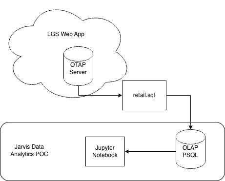

# Introduction
## Business Context

London Gift Shop (LGS) is a UK-based online retailer specializing in giftware products. A large portion of its customers are wholesalers who place recurring bulk orders. Although LGS has operated for over a decade, revenue growth has recently plateaued. The marketing team aims to gain a deeper understanding of customer purchasing behavior in order to enhance acquisition, retention, and overall sales performance.

Since internal IT resources are limited, LGS engaged Jarvis Consulting to deliver a proof-of-concept (PoC) analytics solution. The objective of this project is to analyze historical transaction data and extract actionable insights that support data-driven marketing decisions.

The marketing team can use the analytical results to:

- Identify new vs. returning customer trends.

- Measure monthly active users.

- Understand customer purchasing frequency.

- Design targeted campaigns for customer acquisition.

- Improve retention through loyalty-based promotions.

For example:

- If new customer growth declines, invest in acquisition campaigns.

- If retention drops, introduce loyalty discounts or re-engagement emails.

- If high-value customers are identified, create VIP or wholesale incentives.

## My Role & Technologies Used

As a Data Engineer in this PoC project, I was responsible for:

- Setting up a lightweight PostgreSQL data warehouse using Docker
- Loading transactional retail data into the database
- Performing data wrangling and transformation
- Conducting exploratory data analysis (EDA)
- Generating customer segmentation metrics (new vs existing users, monthly trends)
- Visualizing results using Python
- Tools & Technologies

Python

- Jupyter Notebook
- Pandas & NumPy for data manipulation
- Matplotlib for visualization
- PostgreSQL as a data warehouse
- Docker for containerized database deployment
- SQL for querying retail data

Since this is a PoC project, all work was completed locally using exported SQL data rather than accessing LGS's production Azure environment.

# Implementaion
## Project Architecture
The project follows a simplified analytics pipeline architecture:
1. LGS Web Application generates transaction data.

2. Data is exported into a SQL dump file by LGS IT.

3. The SQL file is loaded into a PostgreSQL database (Docker container).

4. Python (Jupyter Notebook) connects to PostgreSQL.

5. Data is extracted, transformed, and analyzed.

6. Business insights and visualizations are generated for the marketing team to inform their decisions.
## Architecture Diagram

## Data Analytics and Wrangling

Notebook: [Retail Data Analytics](./python_data_wrangling/retail_data_analytics_wrangling.ipynb)

### Key Analytical Tasks

The following business metrics were calculated:

- Monthly revenue trends
- Monthly active users
- New vs existing customer counts
- Customer purchase frequency
- Transaction cancellation patterns
- Country-level sales distribution

Example Insight: New vs Existing Users

Customers were classified as:

- New User: First purchase occurs in a given month
- Existing User: Purchased in previous months

This helps LGS:

- Measure acquisition effectiveness

- Track retention health

- Evaluate marketing ROI

If the proportion of new users decreases while existing users remain stable, LGS may need stronger acquisition campaigns. Conversely, if new users are high but retention is low, focus should shift toward loyalty and customer engagement strategies.

How LGS Can Increase Revenue Using This Analysis

Based on the analytics performed, LGS can:

1. Improve Customer Retention

    Identify months with declining returning customers and implement:
    - Email re-engagement campaigns.
    - Volume-based discounts.
    - Subscription-based reorder reminders.

2. Optimize Marketing Spend

    If acquisition spikes correspond with certain periods:

    - Align campaigns with seasonal buying behavior.
    - Focus on high-conversion months.

3. Segment High-Value Customers

    Using purchase frequency and revenue contribution:

    - Identify the top 10-20% of customers.
    - Offer exclusive promotions or early access.

4. Reduce Revenue Loss from Cancellations

    Analyze invoices with negative amounts to:

    - Identify product or operational issues.
    - Improve logistics or product descriptions.

# Improvements
1. Build Long-Term Customer Retention Table
    Instead of only monthly counts, construct a full retention table to measure long-term retention patterns.

2. Automate the ETL Pipeline
    Replace manual SQL loading with scheduled ETL jobs.

3. Deploy an Interactive Dashboard
    Create a production-ready BI dashboard using:
    - Power BI
    - Or a Flask/FastAPI backend with a visualization frontend