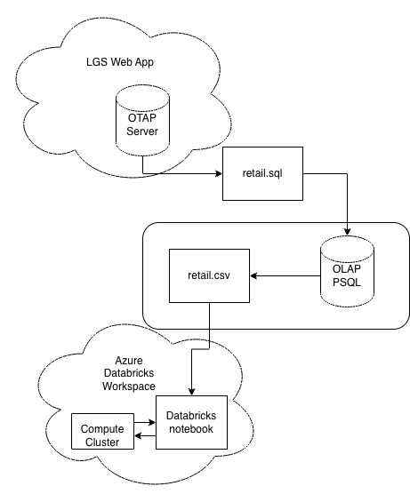
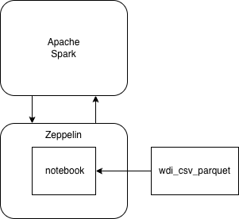
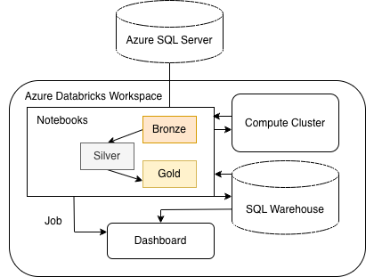
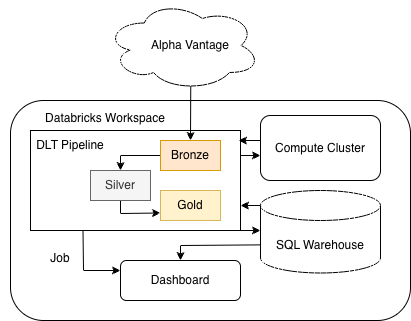

# Introduction
The London Gift Shop (LGS) marketing team previously relied on a data analytics solution built using Jupyter Notebook and Python to analyze customer purchasing behavior. This solution generated valuable insights that enabled the marketing team to design targeted campaigns, such as sending promotional emails to specific customer segments, improving retention and engagement. However, the original solution was difficult to scale because it ran in a single-machine environment.

To address scalability limitations, LGS decided to re-architect the analytics pipeline using Apache Spark, a distributed data processing framework capable of handling large-scale datasets across clusters of machines.

Building on this new architecture, the original analytics workflow was rewritten using PySpark and Spark Structured APIs. This enabled the data pipeline to run in a distributed environment. Two Spark notebook environments, Apache Zeppelin and Azure Databricks, were evaluated for large-scale data processing and analytics. The project demonstrates how the original Python-based analysis can be migrated to a scalable big-data architecture while maintaining the same analytical outcomes.

Additionally, we examine two pipeline implementations using Azure: an ETL pipeline utilizing Azure SQL Database with Azure Databricks, and a Delta Live Tables (DLT) pipeline implemented with the Databricks Free Edition.

The solution leverages modern data engineering tools, including:

- `Apache Spark 3.5.2` / PySpark for distributed data processing.

- Spark Structured APIs (DataFrames and SQL) for scalable analytics workflows.

- `Apache Zeppelin 0.12.0` for interactive data exploration and development.

- `Azure Databricks 16.4`, a managed cloud platform for running Spark workloads.

- `Azure SQL Database` for scalable cloud-based data engineering storage.

By migrating the original single-machine workflow to a distributed Spark-based architecture, this project demonstrates how organizations can scale customer analytics pipelines to handle larger datasets and support enterprise-level data strategies.

# Databricks Implementation
- [Retail Data Analytics with PySpark](./notebook/Retail Data Analytics with PySpark.ipynb)
## Dataset and Analytics Work
The dataset used in this project contains retail transaction records from the London Gift Shop (LGS), including information such as customer IDs, invoice numbers, purchase dates, quantities, and unit prices. The dataset was previously stored in a PostgreSQL database. For this implementation, the data was exported as a CSV file and uploaded into the Databricks environment using the Databricks UI.

Using PySpark and Spark Structured APIs, I recreated the analytics workflow that was previously implemented in Python and pandas. The primary analysis focused on customer segmentation using RFM analysis (Recency, Frequency, Monetary) to better understand customer purchasing behavior. The workflow included data cleaning, feature engineering (e.g., calculating transaction amounts), aggregation of purchase metrics per customer, and assigning customers to marketing segments based on their RFM scores.

## Architecture and Data Flow

The solution was implemented using Azure Databricks. The architecture enables scalable processing of large datasets using distributed computing.

The data pipeline follows these steps:

### Data Source
Transaction data was exported from the PostgreSQL database as a CSV file.

### Data Ingestion
The CSV file was uploaded into Databricks using the Databricks UI and stored as a table within the workspace.

### Data Processing
The dataset was processed using PySpark with Spark's DataFrame and SQL APIs to allow distributed data transformations and aggregations across a cluster.

### Analytics and Feature Engineering
Customer-level metrics such as Recency, Frequency, and Monetary value were computed using PySpark transformations and aggregations.

### Customer Segmentation
Customers were segmented using RFM scoring, enabling marketing teams to categorize customers into groups such as champions, hibernating, and "can't lose" customers.

### Cloud Infrastructure
The solution runs on Azure infrastructure, with Databricks clusters providing scalable compute resources for distributed data processing.

This architecture allows the analytics workflow to scale beyond the limitations of the original single-machine Python solution in the cloud.

## Architecture Diagram

# Zeppelin Implementation
- [WDI Data Analysis](./notebook/wdi-data-analytics.zpln)
## Dataset and Analytics

The World Bank's World Development Indicators (WDI) is the primary, officially recognized compilation of development statistics, featuring over 1,400 indicators across 217 economies and 40+ country groups. The analytics work was performed on a dataset stored as Parquet files in a folder on the local filesystem. Parquet is commonly used in big-data systems because it enables efficient compression and query performance when working with large analytical datasets.

Using Apache Spark within a Zeppelin notebook, the Parquet dataset was loaded into Spark DataFrames and analyzed using Spark SQL and DataFrame transformations. The notebook contains exploratory queries, aggregations, and analytical transformations used to better understand the dataset and derive insights.

## Architecture

The analytics environment is built around `Apache Zeppelin 0.12.0` and `Apache Spark 3.5.8`.

Apache Zeppelin is a web-based notebook environment designed for interactive data analytics and visualization. It integrates directly with Spark and automatically provides access to a SparkSession, allowing users to run Spark code, SQL queries, and data visualizations interactively within notebook cells.

## Data Flow
- The dataset is stored as a folder containing multiple Parquet files on the local filesystem.

- Zeppelin notebooks use the Spark interpreter to create a Spark session.

- Spark reads the dataset using the DataFrame API (e.g., `spark.read.parquet(...)`).

- Analytical queries and transformations are performed using Spark SQL and DataFrame operations.

- Results are displayed directly inside Zeppelin notebooks using tables and built-in visualizations.

## Architecture Diagram

# Azure SQL + Databricks ETL Pipeline

To further enhance scalability and demonstrate production-grade data engineering practices, the project was extended to include an end-to-end ETL pipeline integrating Azure SQL Database with Azure Databricks.

## Architecture Overview

This pipeline demonstrates how transactional data can be ingested, transformed, and analyzed using a cloud-native architecture.

### Notebooks and Manifest
- [Databricks Job Manifest](./notebook/databricks-job.yaml)
- [Bronze](./notebook/Bronze.ipynb)
- [Silver](./notebook/Silver.ipynb)
- [Gold](./notebook/Gold.ipynb)
- [Dashboard PDF Example](./notebook/Dashboard%202026-03-24%2004_00.pdf)

### Dataset
The [Financial Transactions Dataset: Analytics](https://www.kaggle.com/datasets/computingvictor/transactions-fraud-datasets) dataset from Kaggle was used. It is a comprehensive financial dataset that combines transaction records, customer demographics, card details, merchant categories, and fraud labels to enable analysis of customer behavior, spending patterns, and fraud detection across a banking system.

### Data Flow

1. **Data Source**  
   Data is stored in Azure SQL Database.

2. **Data Ingestion (JDBC)**  
   Azure Databricks connects to Azure SQL using JDBC to extract data into Spark DataFrames.

3. **Bronze Layer**  
   Raw data is ingested and stored without modification.

4. **Silver Layer**  
   Data is cleaned, validated, and joined across multiple datasets (e.g., transactions, users, cards).

5. **Gold Layer**  
   Aggregated datasets are created to support analytics and dashboards.

6. **Orchestration**  
   Databricks Workflows are used to automate the pipeline execution and ensure proper sequencing.

7. **Visualization**  
   Databricks dashboards are built on top of gold tables to provide business insights.

## Architecture Diagram

# Delta Live Tables (DLT) Pipeline

To demonstrate modern data engineering practices, a Delta Live Tables (DLT) pipeline was implemented using the Databricks Free Edition. This pipeline ingests real-time financial data from the Alpha Vantage API and processes it using a declarative ETL framework.

## Architecture Overview

The pipeline follows the Medallion architecture (Bronze, Silver, Gold) and is fully managed by DLT, which automatically handles orchestration, dependency management, and data quality enforcement.

### Pipeline Manifest and Source Files
- [config.py](./stock-dlt-project/config/config.py)
- [bronze/api_ingestion.py](./stock-dlt-project/src/bronze/api_ingestion.py)
- [silver/transformations.py](./stock-dlt-project/src/silver/transformations.py)
- [gold/aggregations.py](./stock-dlt-project/src/gold/aggregations.py)
- [DLT Pipeline Manifest](./stock-dlt-project/stock-dlt-project-pipeline.yaml)
- [Dashboard Refresh Job Manifest](./stock-dlt-project/stock-dlt-project-job.yaml)
- [Dashboard PDF Example](./stock-dlt-project/stock-dlt-project%202026-03-24%2016_22.pdf)

### Dataset
Stock market data was retrieved from the Alpha Vantage API. The time series endpoint was used to aggregate data from the following ticker symbols: AMZN, GOOG, IBM, MSFT, and TLSA.

### Data Flow

1. **Data Source (API)**  
   Stock market data is retrieved from the Alpha Vantage API.

2. **Bronze Layer**  
   Raw time-series stock data is ingested and stored.

3. **Silver Layer**  
   Data is cleaned, typed, and structured for analysis and interpretation.

4. **Gold Layer**  
   Analytical tables are created for:
    - Price trend analysis (7, 30, 90 days)
    - Volume trend analysis (rolling averages)

5. **Pipeline Management**  
   DLT automatically manages dependencies, execution order, and monitoring.

## Architecture Diagram

# Future Improvements
1. Integrate Apache Hadoop Storage:
   Future iterations could store the dataset in Hadoop Distributed File System (HDFS) to demonstrate compatibility with legacy big data ecosystems and enable testing Spark workloads on traditional Hadoop-based storage systems.

2. Connect Directly to Azure PostgreSQL via JDBC:
   Instead of uploading LGS CSV files manually, the pipeline could ingest the LGS data directly from an Azure PostgreSQL database using JDBC, enabling automated data ingestion and closer integration with the company's operational data systems.

3. Automate Data Pipelines and Scheduling:
   The LGS analytics workflow could be operationalized using scheduled Databricks jobs to run the RFM segmentation process automatically as new transaction data becomes available.
