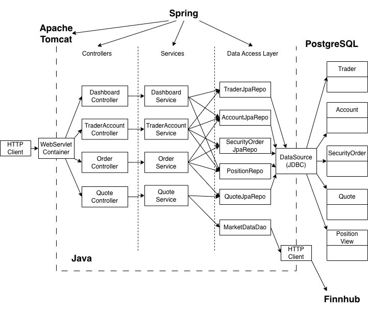
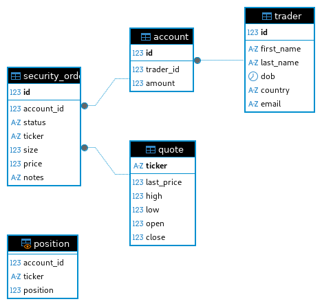

# Introduction

## Option 1:
Download the `docker-compose.yml`
```bash
# From the directory containing docker-compose.yml:
docker compose up -d
```
This will:

- spin up the database and app containers,

- configure networking between them,

- initialize the database schema (on first run),

- start the server on localhost:8080

You can then access the Swagger-UI interface at `localhost:8080/swagger-ui.html` from a web broswer.


## Option 2: Run the containers separately (manual network)
```bash
# Create a Docker network
docker network create trading-net

# Start DB container in the background

docker run --rm -d --name jrvs-pgspring \
--network trading-net \
-p 5432:5432 \
-v pgspringdata:/var/lib/postgresql/data \
fraserraney/trading-db

# Run the application container
 docker run --rm --network trading-net \
 -p 8080:8080 \
 fraserraney/trading-app
```

## Option 3:
```bash
docker compose -f oci://fraserraney/trading-compose:latest up -d
```

# Implementaiton

## Architecture

### Controller Layer (REST APIs)
The controller layer is responsible for handling incoming HTTP requests from clients. It defines REST endpoints using annotations such as @GetMapping and@PostMapping. Controllers parse request parameters, path variables, and request bodies and delegate all business logic to the service layer. Controllers also translate exceptions into appropriate HTTP responses.
### Service Layer (Business Logic)
The service layer contains the core business logic of the application. It coordinates workflows across multiple repositories and external services while enforcing business rules (e.g., checking account balance before buying, validating trader state before deletion). Services are annotated with @Service and are managed by Spring's IoC container. They are responsible for composing data into views such as TraderAccountView and PortfolioView and ensure that controllers remain thin and that logic is testable.
### JPA Repository Layer (Data Access)
The JPA Repository layer abstracts database access using Spring Data JPA. Interfaces such as TraderJpaRepository, AccountJpaRepository, and SecurityOrderJpaRepository extend JpaRepository, which provides CRUD operations out of the box (e.g., save, findById, findAll, delete). Custom query methods are also defined using method naming conventions. This layer interacts directly with PostgreSQL via Hibernate and JDBC but hides SQL complexity from the service layer. For the Position View, the repository is typically read-only.
### Spring Boot: WebServlet / Tomcat and IoC
Spring Boot simplifies application setup and runtime configuration. It embeds Apache Tomcat as the WebServlet container, which handles HTTP request routing, threading, and lifecycle management. Spring?s Inversion of Control (IoC) container manages object creation, dependency injection, and lifecycle using annotations like @Controller, @Service, and @Autowired. This enables loose coupling between components and makes the application easier to test and extend.
### PostgreSQL (PSQL) and Finnhub
PostgreSQL is the persistence layer for the application. It stores traders, accounts, quotes, security orders, and the position view. PostgreSQL runs in a Docker container with a mounted volume to persist data across restarts. Finnhub is an external market data API used to fetch real-time stock information, such as quotes and market status. The application accesses Finnhub through a dedicated MarketDataDao using an HTTP client. Finnhub provides live market data. PostgreSQL stores validated, application-specific state.

## Database
The database schema is defined via an SQL script (sql/ddl.sql). For production or sharing, a custom Docker image (based on postgres:16-alpine) is built that copies the init script to /docker-entrypoint-initdb.d/. On first container startup (with an empty data dir), PostgreSQL runs the script so that the DB is pre-initialized.
### ER Diagram


## REST API Usage
### Swagger

### Quote Controller

### Trader Account Controller

### Order Controller

### Dashboard Controller

# Test

# Deployment

# Improvements